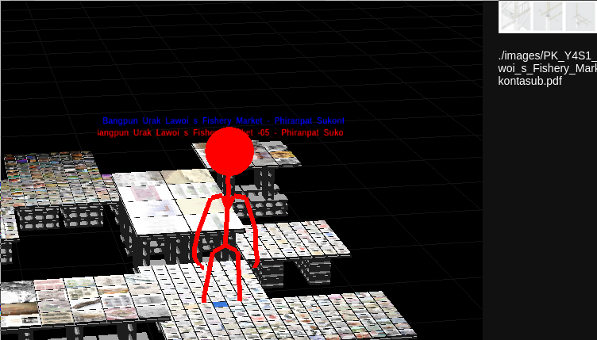
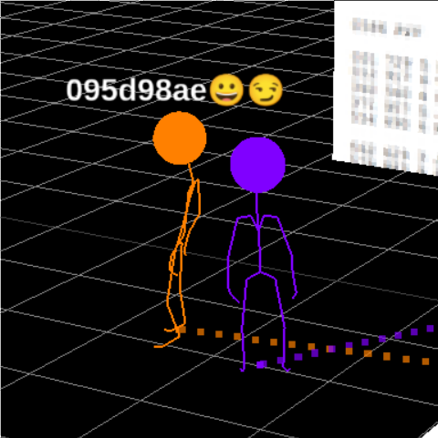
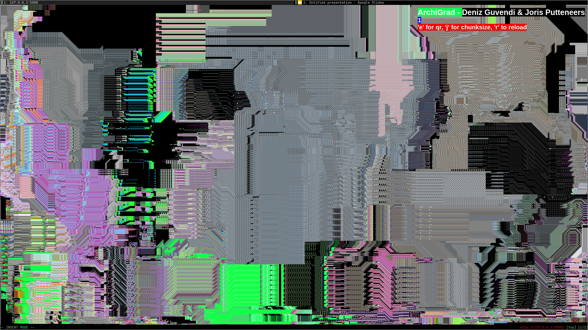
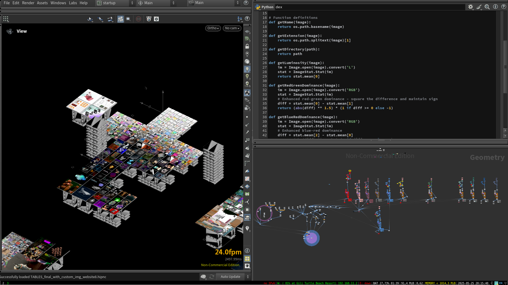

# Parade 2025

This repository contains multiple project branches, each focusing on different technologies and implementations. Below you'll find information about each branch and its specific purpose.


## Interactive Website Branch



the folder is named docs. this is one of github requirements if you want to rujn index.html not in root.
### Setup Instructions
```bash
python -m http.server
```

---


## Multiplayer Block Placing Game Branch



# ArchiGrad - Multiplayer 3D Walking Game
the same setup as the interactive one in terms of movement, player etc. but this on uses wesickets for multiplayer functionality. and the install is a it diferent. 

A real-time multiplayer 3D walking game built with Three.js where players can explore, place blocks with architectural textures, and interact with each other in a shared virtual space.

## What This Does
ArchiGrad is a browser-based multiplayer game where players control animated 3D characters in a shared world. Players can walk around, jump, place textured blocks, drop emoji icons, and see other players in real-time. The game features architectural imagery textures, scoring systems, and various character animations.

## Setup Instructions
### 1. Activate Virtual Environment
```bash
source game/bin/activate
# or on Windows:
# game\Scripts\activate
```
### 2. Update WebSocket IP Address
First, find your local IP address:
```bash
hostname -I
```
Then update the WebSocket connection in `index.html` (around line 647):
```javascript
// Replace with your IP address from hostname -I
this.socket = new WebSocket('ws://YOUR_IP_ADDRESS:8765');
```
### 3. Start the WebSocket Server
```bash
python server.py
```
### 4. Start the HTTP Server
In a new terminal (keep the WebSocket server running):
```bash
python -m http.server 8000
```
### 5. Access the Game
Open your browser and navigate to:
```
http://localhost:8000
```
Or access from other devices on the same network:
```
http://YOUR_IP_ADDRESS:8000
```
## Game Controls
### Movement
- **A** - Move forward
- **B** - Move backward  
- **D** - Rotate left
- **E** - Rotate right
- **A + B** - Toggle between perspective and top-down camera view
### Actions
- **Space** - Jump
- **P** - Place a textured block (aim with crosshair)
- **F** - Drop random emoji icon at your location
- **C** - Play random character animation (angry, aim, clapping, dismiss, jump)
### Game Features
#### Block Placement
- Aim the crosshair at surfaces or empty space
- Press **P** to place blocks with random architectural textures
- Blocks can be placed on the ground or stacked on other blocks
- Player proximity to blocks is tracked for scoring
#### Character System
- Each player has a unique colored skeleton representation
- Animated head sphere for easy identification
- Various animations: idle, walking, jumping, emoting
- Player names displayed above characters
#### Scoring & Interaction
- Proximity to textured blocks awards points
- Image scoreboard shows most popular textures
- Player scoreboard tracks individual scores
- Real-time activity log shows recent player actions
#### Multiplayer Features
- Real-time position synchronization
- Player trails showing movement history
- Emoji placement visible to all players
- Character animations synchronized across clients
- Automatic player cleanup on disconnect
## Technical Features
- **WebSocket-based networking** for real-time multiplayer
- **Three.js 3D rendering** with skeletal animations
- **Performance monitoring** with FPS/memory stats
- **Collision detection** for blocks and world boundaries
- **Dynamic texture loading** from architectural image library
- **Responsive camera system** with multiple view modes
## File Structure
- `index.html` - Main game client with Three.js rendering
- `server.py` - WebSocket server handling multiplayer communication
- `style.css` - Game styling (referenced but not provided)
- `/images/` - Directory containing architectural texture images
- Animation files: `idle.glb`, `walking.glb`, `emote.glb`, etc.
## Requirements
- Python 3.7+
- Modern web browser with WebGL support
- Local network access for multiplayer functionality
- WebSocket support (`websockets` Python package)
## Notes
- Game uses a fixed spawn area and world boundaries
- Maximum of 10 recent messages are stored
- Block textures are randomly selected from architectural image collection
- Player colors are automatically assigned based on connection order

---


## LED Screen Game Branch

pixelsorting led wall screen. with qr code functionality. if you want the qr code to work, make sure you change the ip adress with th enew one through hostname -I. also run websockets first, then the server.
it basically takes a printscreen, does a request to imagebb with right credentials,  uploads it , gives a link, converts that link into a qr, serves that qr to the user.


---


## Pi Configuration Branch

### Overview
Basic Pi setup with OS, window manager, shell and dependencies.

### File Structure
```
[joris@thinkpad ~/Documents/archiGrad/parade_2025/pi_config_files]$ tree -al
.
├── alanpeabody.zsh-theme
├── config
├── make_img.sh
├── manual.md
├── setup.sh
├── .tmux.conf
├── .vimrc
└── .zshrc
```

### Setup Instructions
1. Run the setup script to automatically configure your Raspberry Pi environment:
```bash
./setup.sh
```

2. Manually start the display manager:
```bash
sudo systemctl start lightdm
```

---

## Houdini Table Sorting Branch



---

